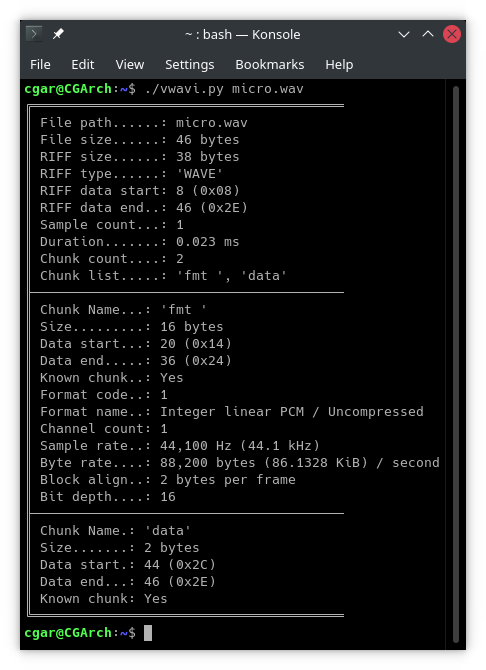
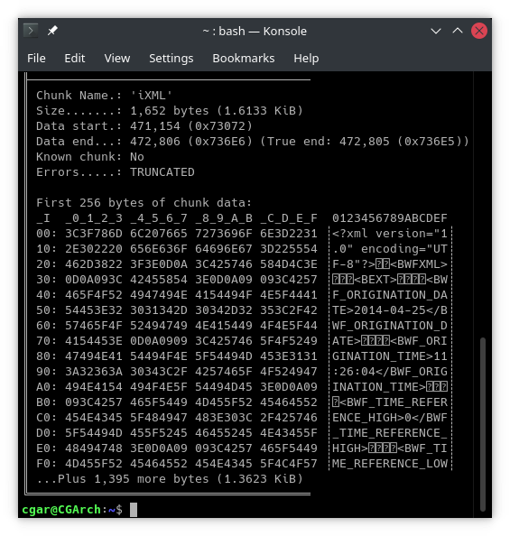
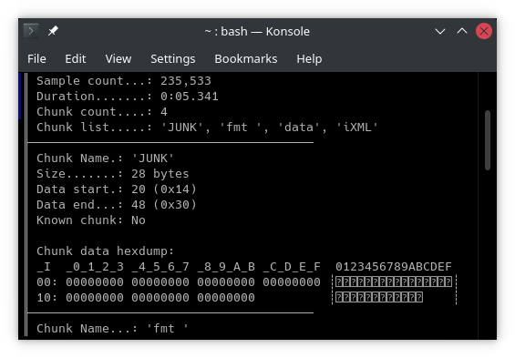

# vwavi (verbose-wav-info)
A handy python script to give detailed information about various formats of wav files.

More detailed information can be useful for tracking down odd issues. Such as a file not playing in a specific program for some unknown reason.

Other tools such as soxi, ffprobe or mediainfo may not be able to display the relevant information, such as if there is a missing padding byte in the data block.

This tool aims to be as verbose as possible to aid in such circumstances. Almost every single field from the file will be displayed (if parsable), especially data from the format chunk (`'fmt '`).  
Information will also be given for any errors that may be present in the file, such as incorrect chunk ordering, file truncation, missing chunks, etc. As well as various sanity checks of the data in the format chunk if the format is type 1, uncompressed.

Although verbose information is the focus, the script will try to present information in an easily digestable manner. It will by default use unicode box drawing characters to make chunk bounteries clear, and where applicable, data is displayed in multiple forms. Such as displaying Megabytes as well as bytes, offsets in hex as well as decimal, and commas inside long decimal numbers for easier reading.

vwavi can currently parse information from the format chunk of the following WAVE formats:
| ID (dec) | ID (hex) |                              Format Name                                | Including extended data |
|---------:|---------:|-------------------------------------------------------------------------|:-----------------------:|
|        1 |        1 | Integer linear PCM / Uncompressed                                       |             ✅           |
|        2 |        2 | Microsoft adaptive differential PCM (MS ADPCM)                           |             ✅           |
|        3 |        3 | IEEE 754 floating point PCM                                              |             ❌           |
|        7 |        7 | ITU-T G.711 µ-law                                                       |             ❌           |
|        6 |        6 | ITU-T G.711 A-law                                                       |             ❌           |
|       17 |       11 | Interactive Multimedia Association adaptive differential PCM (IMA ADPCM) |             ✅           |
|       80 |       50 | MPEG-1 Audio (MP2)                                                      |             ❌           |
|       85 |       55 | MPEG Layer-III (MP3)                                                    |             ✅           |
|    65534 |     FFFE | WAVE_FORMAT_EXTENSIBLE                                                  |             ✅           |

&nbsp;  
There is also support for reading metadata from LIST chunks of type INFO. This has information like track title, number, artist, etc.

Additionally, if a chunk does not yet have a parser, a small hexdump of the first 256 bytes will be displayed.  
This will also occur if there is extra data at the end of the file that is not accounted for by the RIFF size header. Unless the extra data is another WAVE file, in this case it will be parsed like a normal file and it's details will be appended after the current file's info, along with a message indicationg it as a concatenated wav.

## sample output screenshots:

## usage:
    vwavi.py [-h] [--raw] [--no-border] [--pickle] WAV_FILE_OR_FOLDER [WAV_FILE_OR_FOLDER ...]

    positional arguments:
        WAV_FILE_OR_FOLDER  Path to wav file(s) or wav containing folder(s) (recursive *.WAV search)

    optional arguments:
        -h, --help      show this help message and exit
        --raw           pprint the wavs_info object directly without processing
        --no-border     Disable RIFF and chunk borders
        --pickle        Change output format to a python pickle object

